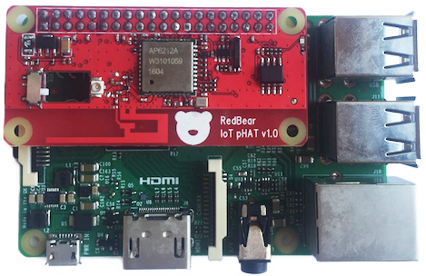
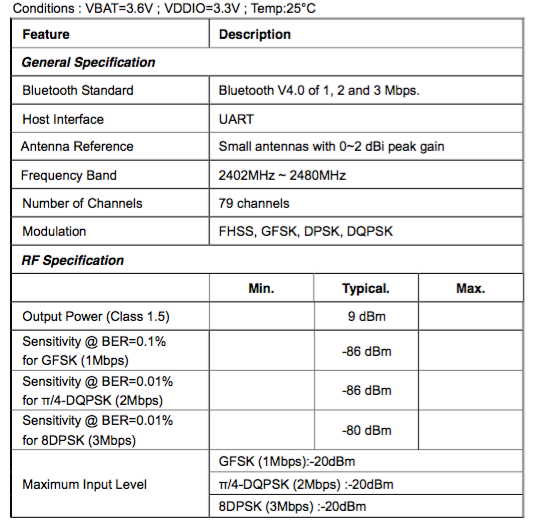

# IoT pHAT

RedBear IoT pHAT, designed for the Raspberry Pi Zero (Other RPi boards with 40-pin header will also work).

The RPi Zero is a nice board, it is small in size which is very good for developing IoT projects. However, it lacks of wireless features such as WiFi and Bluetooth.

With the IoT pHAT, now, your RPi Zero will get more powerful than before. It adds WiFi and Bluetooth wireless technologies to the RPi Zero.

	Note for beta testers with older version of the IoT pHAT:

		This is for the hardware version 1.0 only, the EEPROM contains the information for automatically starting the WiFi, Bluetooth and other settings.
	
* Front View

	

* Back View

	

## Block Diagram
	

## Features

* AMPAK AP6212A Wireless Module (Broadcom BCM43438 A1 chip inside)
	- WiFi (802.11bgn / 2.4GHz)
	- Bluetooth (4.1) and BLE support
* Single antenna for concurrent WiFi and Bluetooth operations
	- Onboard PCB antenna
	- External antenna connector
 	- Antenna switch for extenal antenna
* 32 Kbit (4 KByte) EEPROM for DTOverlay configuration
* 40-pin connector
	- WiFi: SDIO v2.0 - up to 50 MHz clock rate
	- Bluetooth: UART (up to 4 Mbps)
* FCC/CE certified

## How to play

### Prerequisites

* Raspberry Pi Zero or other models with 40 pin connector header
	- HDMI Cable
	- USB Keyboard
	- Power adpater (5V) with micro USB connector
* SD Card with [NOOBS or Raspbian](https://www.raspberrypi.org/downloads/) installed (tested on NOOBS 1.9.2)
* Additional Items for RPi Zero
	- Mini HDMI to normal HDMI convertor
	- Micro to Type-A USB convertor
* Optional
	- Bluetooth Keyboard
	- Bluetooth Mouse
	- Bluetooth Gamepad
		
### Setting up the boards

* Stack the IoT pHAT on top of the RPi Zero
* Connect the board to your TV or monitor via the HDMI cable
* Connect your RPi with a wired keyboard (For associate WiFi to access point and connect Bluetooth accessories)
* Power on with an micro USB cable with power adpater

The IoT pHAT will also work on other 40-pin RPi boards such as RPi Model A+ and RPi 2.

### WiFi

* After booting up, the Linux kernel will read the configuration from the onboard EEPROM, it will turn on the WiFi
* Now you can use the WiFi to connect to your wireless router or access point directly.
* You will see the WiFi driver is up by typing the follow command using the command line,

	`$ ifconfig`

### Bluetooth

* Again, upon booting up the board, the Kernel will read from the EEPROM for all settings for the Bluetooth including the UART.
* You will see the Bluetooth is ready to use by using the Bluetooth manager (the Bluetooth icon) near to the clock (upper-right corner) or using the command line,

	`$ hciconfig`

### Pair Keyboard/Mouse/Gamepad

You can use the command line tool `bluetoothctl` or the Bluetooth manager to pair your Bluetooth accessories.

## Pinout

The following diagram shows the pins of the RPi 40-pin connector occupied by the IoT pHAT board.

Note that, the TXD on the RPi (as shown in the diagram) will connect to the RXD of the IoT pHAT, the same case applied to the RXD, CTS and RTS pins. 

## Specification

### General

* Model Name				: IoT pHAT
* Product Description		: WiFi and Bluetooth connectivity add-on board for Raspberry Pi Zero
* Dimension					: 64 mm x 30 mm
* WiFi Interface			: SDIO v2.0
* Bluetooth Interface		: UART / PCM
* Operating voltage			: 3.3V
* Operating temperature		: -30˚C to 85˚C
* Storage temperature		: -40˚C to 85˚C
* Humidity					: Operating Humidity 10% to 95% Non-Condensing

### WiFi

### Bluetooth

## Limitations

* FM is not supported with the board
* Although the board supports Bluetooth keyboard, you still need to use a wired keyboard to set up for it.

